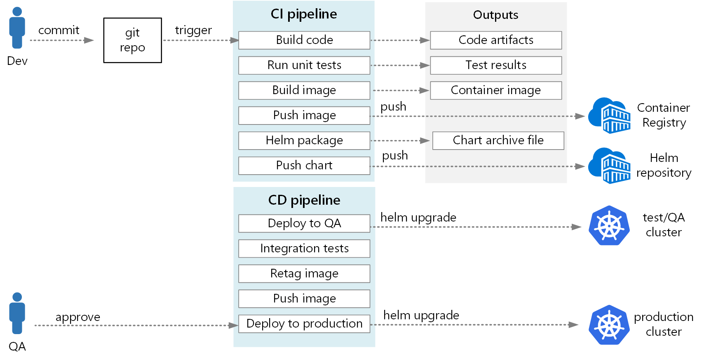

为微服务体系结构创建可靠的 CI/CD 过程可能很有挑战性。 单个团队必须能够快速可靠地发布服务，而不会干扰其他团队或使应用程序整体不稳定。

本文介绍一个示例 CI/CD 管道，用于将微服务部署到 Kubernetes 服务。 每个团队和项目都不同，因此请不要将本文视为一组硬性且快速的规则。 相反，它旨在作为设计自己的 CI/CD 过程的起点。

Kubernetes 托管微服务的 CI/CD 管道的目标可以总结如下：

* Teams可以独立生成和部署其服务。
* 传递 CI 过程的代码更改会自动部署到类似生产的环境中。
* 管道的每个阶段都强制实施质量入口。
* 服务的新版本可以与以前的版本并行部署。

## 假设

对于此示例，下面是有关开发团队和基本代码的一些假设：

* 代码存储库是单一存储库，包含按微服务组织的文件夹。
* 团队的分库策略以基于主库的开发为基础。
* 团队使用 发布分支 来管理发布。 将针对每个微服务创建单独的版本。
* CI/CD 过程Azure Pipelines AKS 生成、测试和部署微服务。
* 每个微服务的容器映像存储在Azure 容器注册表。
* 该团队使用 Helm 图表打包每个微服务。

这些假设驱动 CI/CD 管道的许多特定详细信息。 但是，此处介绍的基本方法适用于其他进程、工具和服务，例如 Jenkins 或 Docker Hub。

## 验证生成

假设开发人员正在处理名为"传递服务"的微服务。 在开发新功能时，开发人员会将代码签入到某个功能分库中。 根据约定，功能分库名为 feature/*。


生成定义文件包含一个触发器，该触发器按分支名称和源路径进行筛选：

```YAML
trigger:
  batch: true
  branches:
    include:
    # for new release to production: release flow strategy
    - release/delivery/v*
    - refs/release/delivery/v*
    - master
    - feature/delivery/*
    - topic/delivery/*
  paths:
    include:
    - /src/shipping/delivery/
```

使用此方法，每个团队都可以有自己的生成管道。 只有签入到 文件夹中 `/src/shipping/delivery` 的代码才能触发传递服务的生成。 将提交推送到与筛选器匹配的分支会触发 CI 生成。 在工作流中，CI 生成此时会运行某种最低程度的代码验证：

1. 生成代码。
2. 运行单元测试。

目标是使生成时间短，以便开发人员能够快速获得反馈。 功能准备好合并到 master 后，开发人员将打开 PR。 此操作将触发执行一些附加检查的另一个 CI 生成：

1. 生成代码。
2. 运行单元测试。
3. 生成运行时容器映像。
4. 对映像运行漏洞扫描。


> 备注
>
> 在Azure DevOps Repos中，可以定义策略来保护分支。 例如，策略可以要求在合并到主库之前，必须成功完成 CI 生成并由审批人员签署同意书。

## 完整的 CI/CD 生成

有时候，团队可以部署新版传送服务。 发布管理器通过以下命名模式从主分支创建分支 `release/<microservice name>/<semver> `：。 例如，`release/delivery/v1.0.2`。


创建此分支会触发运行上述所有步骤的完整 CI 生成以及：

1. 将容器映像推送到Azure 容器注册表。 该映像标记有版本号（取自分库名称）。
2. 运行 `helm package` 以打包服务的 Helm 图表。 图表还标有版本号。
3. 将 Helm 包推送到容器注册表。

假设此生成成功，它会使用 Azure Pipelines 发布管道 (CD) 进程触发部署。 此管道包括以下步骤：

1. 将 Helm 图表部署到 QA 环境。
2. 审批者签署同意书，然后包就会转到生产环境。 请参阅通过审批进行发布部署控制。
3. 在映像中重新标记生产命名空间的 Docker Azure 容器注册表。 例如，如果当前标记为 `myrepo.azurecr.io/delivery:v1.0.2`，则生产标记为 `myrepo.azurecr.io/prod/delivery:v1.0.2`。
将 Helm 图表部署到生产环境。

即使在单一资源中，这些任务也可以以单个微服务为作用域，以便团队能够高速进行部署。 该过程有一些手动步骤：批准拉入、创建发布分支和批准生产群集中的部署。 这些步骤是手动的;如果组织愿意，可以自动执行这些操作。

## 环境隔离

你将拥有多个部署服务的环境，包括用于开发、冒烟测试、集成测试、负载测试以及最后用于生产环境的环境。 这些环境需要某种程度的隔离。 在 Kubernetes 中，可以选择物理隔离或逻辑隔离。 物理隔离表示部署到独立的群集。 逻辑隔离使用命名空间和策略，如前文所述。

我们建议创建专用的生产群集，并为开发/测试环境创建独立的群集。 使用逻辑隔离来隔离开发/测试群集中的环境。 部署到开发/测试群集的服务不得有权访问保存业务数据的数据存储。

## 生成过程

如果可能，将生成过程打包到 Docker 容器中。 此配置允许使用 Docker 生成代码项目，而无需在每个生成计算机上配置生成环境。 容器化生成过程通过添加新的生成代理，可轻松横向扩展 CI 管道。 此外，团队的任何开发人员都可以通过运行生成容器来生成代码。

通过使用 Docker 中的多阶段生成，可以在单个 Dockerfile 中定义生成环境和运行时映像。 例如，下面是生成 .NET 应用程序的 Dockerfile：

```Dockerfile
FROM mcr.microsoft.com/dotnet/core/runtime:3.1 AS base
WORKDIR /app

FROM mcr.microsoft.com/dotnet/core/sdk:3.1 AS build
WORKDIR /src/Fabrikam.Workflow.Service

COPY Fabrikam.Workflow.Service/Fabrikam.Workflow.Service.csproj .
RUN dotnet restore Fabrikam.Workflow.Service.csproj

COPY Fabrikam.Workflow.Service/. .
RUN dotnet build Fabrikam.Workflow.Service.csproj -c release -o /app --no-restore

FROM build AS testrunner
WORKDIR /src/tests

COPY Fabrikam.Workflow.Service.Tests/*.csproj .
RUN dotnet restore Fabrikam.Workflow.Service.Tests.csproj

COPY Fabrikam.Workflow.Service.Tests/. .
ENTRYPOINT ["dotnet", "test", "--logger:trx"]

FROM build AS publish
RUN dotnet publish Fabrikam.Workflow.Service.csproj -c Release -o /app

FROM base AS final
WORKDIR /app
COPY --from=publish /app .
ENTRYPOINT ["dotnet", "Fabrikam.Workflow.Service.dll"]
```

此 Dockerfile 定义多个生成阶段。 请注意，名为 的 `base` 阶段使用 .NET 运行时，而名为 的阶段 `build` 使用完整的 .NET SDK。 `build`阶段用于生成 .NET 项目。 但最终的运行时容器基于 生成，该容器仅包含运行时，并且明显小于 `base` 完整的 SDK 映像。

### 生成测试运行程序

另一个好的做法是在容器中运行单元测试。 例如，下面是生成测试运行程序 Docker 文件的一部分：

```Dockerfile
FROM build AS testrunner
WORKDIR /src/tests

COPY Fabrikam.Workflow.Service.Tests/*.csproj .
RUN dotnet restore Fabrikam.Workflow.Service.Tests.csproj

COPY Fabrikam.Workflow.Service.Tests/. .
ENTRYPOINT ["dotnet", "test", "--logger:trx"]
```

开发人员可以使用此 Docker 文件在本地运行测试：

```Bash
docker build . -t delivery-test:1 --target=testrunner
docker run delivery-test:1
```

CI 管道还应在生成验证步骤中运行测试。

请注意，此文件使用 Docker `ENTRYPOINT` 命令来运行测试，而不是 Docker `RUN` 命令。

* 如果使用 命令 `RUN` ，则每次生成映像时都会运行测试。 通过使用 `ENTRYPOINT` ，测试将选择加入。 它们仅在显式面向阶段时 `testrunner` 运行。
* 测试失败不会导致 Docker build 命令失败。 这样，就可以将容器生成失败与测试失败区区。
* 可以将测试结果保存到已装载的卷。

## 容器最佳做法

下面是针对容器要考虑的一些其他最佳做法：

* 针对要部署到群集中的资源（pod、服务等），定义组织范围的容器标记约定、版本控制和命名约定。 这样，便可以更轻松地诊断部署问题。

* 在开发和测试周期，CI/CD 过程将生成许多容器映像。 只有其中一些映像是发布候选项，只有其中一些候选发布将被提升为生产。 制定明确的版本控制策略，以便了解当前部署到生产环境的映像，并在必要时帮助回滚到以前的版本。

* 始终部署特定的容器版本标记，而不是 `latest` 。

* 使用 Azure 容器注册表 命名空间将已批准用于生产的映像与仍在测试的映像隔离。 在准备好将映像部署到生产环境之前，请不要将映像移到生产命名空间中。 如果将这种做法与容器映像的语义版本控制结合使用，则可以减少意外部署尚未批准发布的版本的可能性。

* 遵循最低特权原则，以非特权用户角色运行容器。 在 Kubernetes 中，可以创建一个阻止容器作为根 运行的 Pod 安全策略。 请参阅 使用根权限防止 Pod 运行。

## Helm 图表

考虑使用 Helm 来管理服务的生成和部署。 以下是帮助实现 CI/CD 的 Helm 的一些功能：

* 通常，单个微服务由多个 Kubernetes 对象定义。 Helm 允许将这些对象打包到单个 Helm 图表中。
* 可以使用单个 Helm 命令而不是一系列 kubectl 命令部署图表。
* 图表已显式版本控制。 使用 Helm 发布版本、查看版本并回滚到以前的版本。 使用语义版本控制以及用于回滚到以前版本的功能来跟踪更新和修订。
* Helm 图表使用模板来避免跨多个文件复制标签和选择器等信息。
* Helm 可以管理图表之间的依赖关系。
* 图表可以存储在 Helm 存储库中（例如 Azure 容器注册表）中，并集成到生成管道中。

有关将容器注册表用作 Helm 存储库的详细信息，请参阅将 Azure 容器注册表用作应用程序图表的 Helm 存储库。

> 重要
>
> 此功能目前处于预览状态。 需同意补充使用条款才可使用预览版。 在正式版 (GA) 推出之前，此功能的某些方面可能会有所更改。

单个微服务可能涉及多个 Kubernetes 配置文件。 更新服务可能意味着触摸所有这些文件以更新选择器、标签和图像标记。 Helm 将这些文件视为一个称为图表的包，并允许你使用变量轻松更新 YAML 文件。 Helm 使用基于 Go (的模板语言) 编写参数化的 YAML 配置文件。

例如，下面是定义部署的 YAML 文件的一部分：

```YAML
apiVersion: apps/v1
kind: Deployment
metadata:
  name: {{ include "package.fullname" . | replace "." "" }}
  labels:
    app.kubernetes.io/name: {{ include "package.name" . }}
    app.kubernetes.io/instance: {{ .Release.Name }}
  annotations:
    kubernetes.io/change-cause: {{ .Values.reason }}

...

  spec:
      containers:
      - name: &package-container_name fabrikam-package
        image: {{ .Values.dockerregistry }}/{{ .Values.image.repository }}:{{ .Values.image.tag }}
        imagePullPolicy: {{ .Values.image.pullPolicy }}
        env:
        - name: LOG_LEVEL
          value: {{ .Values.log.level }}
```

可以看到，部署名称、标签和容器规格都使用部署时提供的模板参数。 例如，从命令行：

```Bash
helm install $HELM_CHARTS/package/ \
     --set image.tag=0.1.0 \
     --set image.repository=package \
     --set dockerregistry=$ACR_SERVER \
     --namespace backend \
     --name package-v0.1.0
```

虽然 CI/CD 管道可以直接将图表安装到 Kubernetes，但我们建议创建图表存档 (.tgz 文件) ，将图表推送到 Helm 存储库。 

请考虑将 Helm 部署到其自己的命名空间，使用基于角色的访问控制 (RBAC) 来限制它可以部署到的命名空间。 有关详细信息，请参阅 Helm 文档中的基于 角色的访问控制。

## 修订

Helm 图表始终具有版本号，该版本号必须使用 [语义版本控制](https://semver.org/)。 图表还可以具有 `appVersion` 。 此字段是可选的，不必与图表版本相关。 某些团队可能希望将应用程序版本与图表更新分开。 但更简单的方法是使用一个版本号，因此图表版本和应用程序版本之间存在 1：1 关系。 这样一来，可以存储每个发布的一个图表，并轻松部署所需的版本：

```Bash
helm install <package-chart-name> --version <desiredVersion>
```

另一个好的做法是在部署模板中提供更改原因批注：

```YAML
apiVersion: apps/v1
kind: Deployment
metadata:
  name: {{ include "delivery.fullname" . | replace "." "" }}
  labels:
     ...
  annotations:
    kubernetes.io/change-cause: {{ .Values.reason }}
```

这样，可以使用 命令查看每个修订版本的更改原因 kubectl rollout history 字段。 在上一示例中，更改原因作为 Helm 图表参数提供。

```Bash
kubectl rollout history deployments/delivery-v010 -n backend
```

```输出
deployment.extensions/delivery-v010
REVISION  CHANGE-CAUSE
1         Initial deployment
```

还可使用 命令 helm list 查看修订历史记录：

```Bash
helm list
```

```输出
NAME            REVISION    UPDATED                     STATUS        CHART            APP VERSION     NAMESPACE
delivery-v0.1.0 1           Sun Apr  7 00:25:30 2020    DEPLOYED      delivery-v0.1.0  v0.1.0          backend
```

## Azure DevOps管道

在Azure Pipelines中，管道分为生成管道和发布管道。 生成管道运行 CI 过程并创建生成项目。 对于 Kubernetes 上的微服务体系结构，这些项目是定义每个微服务的容器映像和 Helm 图表。 发布管道运行将微服务部署到群集的 CD 进程。

根据本文前面所述的 CI 流，生成管道可能包含以下任务：

1. 生成测试运行程序容器。

```YAML
- task: Docker@1
  inputs:
    azureSubscriptionEndpoint: $(AzureSubscription)
    azureContainerRegistry: $(AzureContainerRegistry)
    arguments: '--pull --target testrunner'
    dockerFile: $(System.DefaultWorkingDirectory)/$(dockerFileName)
    imageName: '$(imageName)-test'
```

2. 通过针对测试运行程序容器调用 docker run 来运行测试。

```YAML
- task: Docker@1
  inputs:
    azureSubscriptionEndpoint: $(AzureSubscription)
    azureContainerRegistry: $(AzureContainerRegistry)
    command: 'run'
    containerName: testrunner
    volumes: '$(System.DefaultWorkingDirectory)/TestResults:/app/tests/TestResults'
    imageName: '$(imageName)-test'
    runInBackground: false
```

3. 发布测试结果。 请参阅 生成映像。

```YAML
- task: PublishTestResults@2
  inputs:
    testResultsFormat: 'VSTest'
    testResultsFiles: 'TestResults/*.trx'
    searchFolder: '$(System.DefaultWorkingDirectory)'
    publishRunAttachments: true
```

4. 生成运行时容器。

```YAML
- task: Docker@1
  inputs:
    azureSubscriptionEndpoint: $(AzureSubscription)
    azureContainerRegistry: $(AzureContainerRegistry)
    dockerFile: $(System.DefaultWorkingDirectory)/$(dockerFileName)
    includeLatestTag: false
    imageName: '$(imageName)'
```

5. 将容器映像推送Azure 容器注册表 (或其他容器注册表) 。

```YAML
- task: Docker@1
  inputs:
    azureSubscriptionEndpoint: $(AzureSubscription)
    azureContainerRegistry: $(AzureContainerRegistry)
    command: 'Push an image'
    imageName: '$(imageName)'
    includeSourceTags: false
```

6. 打包 Helm 图表。

```YAML
- task: HelmDeploy@0
  inputs:
    command: package
    chartPath: $(chartPath)
    chartVersion: $(Build.SourceBranchName)
    arguments: '--app-version $(Build.SourceBranchName)'
```

7. 将 Helm 包推送Azure 容器注册表 (或其他 Helm 存储库) 。

```YAML
task: AzureCLI@1
  inputs:
    azureSubscription: $(AzureSubscription)
    scriptLocation: inlineScript
    inlineScript: |
    az acr helm push $(System.ArtifactsDirectory)/$(repositoryName)-$(Build.SourceBranchName).tgz --name $(AzureContainerRegistry);
```

CI 管道的输出是生产就绪容器映像和微服务的已更新 Helm 图表。 此时，发布管道可以接管。 它执行以下步骤：

* 部署到开发/QA/过渡环境。
* 等待审批者批准或拒绝部署。
* 重新标记要发布的容器映像
* 将发布标记推送到容器注册表。
* 升级生产群集中的 Helm 图表。

下图显示了本文中所述的端到端 CI/CD 过程：


