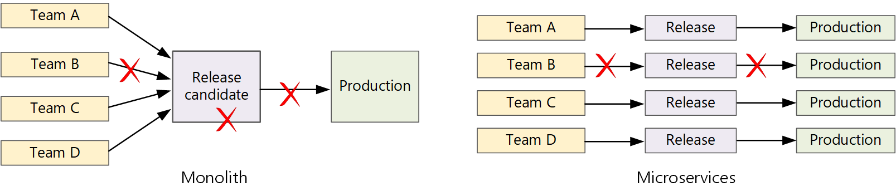

更快的发布周期是微服务体系结构的主要优势之一。 但是，如果没有良好的 CI/CD 流程，你将不会实现微服务承诺的灵活性。 本文介绍挑战，并推荐一些解决问题的方法。

## 什么是 CI/CD？

当我们讨论 CI/CD 时，我们真正讨论几个相关过程：持续集成、持续交付和持续部署。

* **持续集成。** 代码更改经常合并到主分支中。 自动生成和测试过程可确保主分支中的代码始终采用生产质量。

* **持续交付。** 通过 CI 过程的任何代码更改都会自动发布到类似生产的环境。 部署到实时生产环境可能需要人工批准，否则可自动进行。 目标是让代码始终做好部署到生产环境的准备。

* **持续部署。** 通过前两个步骤的代码更改会自动部署到 生产 中。

下面是微服务体系结构的可靠 CI/CD 过程的一些目标：

* 每个团队可以独立生成并部署自有的服务，而不影响或干扰其他团队。

* 新服务版本在部署到生产环境之前，会先部署到开发/测试/QA 环境进行验证。 在每个阶段强制实施质量控制。

* 服务的新版本可以与以前的版本并行部署。

* 实施足够的访问控制策略。

* 对于容器化工作负荷，可以信任部署到生产环境的容器映像。

## 为什么可靠的 CI/CD 管道很重要

在传统的整体式应用程序中，有一个生成管道，其输出是应用程序可执行文件。 所有开发工作都会馈送到此管道中。 如果发现了高优先级 bug，则必须集成、测试然后发布修复程序，这可能会延缓新功能的发布。 可以通过使用考虑良好的模块和使用功能分支来缓解这些问题，以最大程度地降低代码更改的影响。 但是，随着应用程序变得越来越复杂和更多功能的添加，整体应用程序的发布过程往往会变得更加脆弱且可能中断。

根据微服务的理念，永远不应出现一个要让每个团队遵守的冗长发布周期。 生成服务“A”的团队随时可以发布更新，而无需等到已合并、测试并部署服务“B”中的更改。

若要实现较高的发布速度，发布管道必须自动化且高度可靠，以最大程度地降低风险。 如果每天发布一次或多次生产，则回归或服务中断必须很少见。 同时，如果部署了错误的更新，则必须通过可靠的方式快速回滚或者前滚到以前的服务版本。

## 挑战

* **许多小型的独立代码库。** 每个团队负责使用自己的生成管道生成自己的服务。 在某些组织中，团队可能会使用单独的代码存储库。 单独的存储库可能导致以下情况：了解如何构建系统的知识分散在团队之间，而组织中任何人都不知道如何部署整个应用程序。 例如，在灾难恢复方案中，如果需要快速部署到新群集，会发生什么情况？ 
缓解措施：使用统一的自动化管道来生成和部署服务，以便每个团队中不会"隐藏"这些知识。
 

* **多种语言和框架**。 如果每个团队混合使用其自身的技术，则可能难以创建一套可在整个组织中运用的单一生成过程。 生成过程必须足够灵活，使每个团队能够根据所选的语言或框架来改编它。 
缓解：将每个服务的生成过程容器化。 这样，生成系统只需能够运行容器。
 

* **集成和负载测试**。 如果团队根据自己的步调发布更新，则可能难以设计可靠的端到端测试，尤其是当服务彼此依赖时。 此外，运行完整生产群集的成本可能很高，因此，每个团队不太可能在生产规模下运行自己的完整群集，只是为了进行测试。

* **发布管理**。 每个团队都应能够将更新部署到生产环境。 这并不意味着每个团队成员都有权这样做。 但是，设置集中式“发布管理员”角色可能降低部署速度。 
缓解措施：CI/CD 过程的自动化程度和可靠性越小，就不需要中央机构。 也就是说，可以对主要功能更新与次要 bug 修复的发布采用不同的策略。 分散并不意味着零治理。
 

* **服务更新**。 将某个服务更新到新版本时，更新过程不应中断依赖于该服务的其他服务。 
缓解：使用蓝绿或 Canary 等部署技术进行非中断性变更。 对于中断性 API 更改，请与以前的版本一起部署新版本。 这样，就可以针对新 API 更新和测试使用上一 API 的服务。 请参阅 下面的更新服务。

## Monorepo 与多存储库

在创建 CI/CD 工作流之前，必须了解如何对代码库进行结构设计和管理。

* 团队是使用单独的存储库还是单一存储库 (单一存储库) ？
* 什么是分库策略？
* 谁可以将代码推送到生产环境中？ 是否有发布经理角色？

首选单存储库方法，但二者各有优缺点。

|      | 单存储库                                                                                                       | 多存储库                                                                                       |
| ---- | -------------------------------------------------------------------------------------------------------------- | ---------------------------------------------------------------------------------------------- |
| 优点 | 代码共享、更易于实现代码和工具的标准化、更易于重构代码、可发现性 - 代码的单一视图                              | 按团队清除所有权、合并冲突可能会更少、有助于强制分离微服务                                     |
| 挑战 | 对共享代码进行的更改可能影响多个微服务、合并冲突可能会更多、工具必须缩放成大型代码库、访问控制、部署过程更复杂 | 更难以共享代码、更难以强制实施编码标准、依赖项管理、代码库分散，可发现性低、缺少共享的基础架构 |

## 更新服务

可通过多种策略来更新已部署到生产环境的服务。 下面介绍三个常用选项：滚动更新、蓝绿部署和 Canary 发布。

### 滚动更新

在滚动更新中部署服务的新实例，然后，新实例可开始立即接收请求。 启动新实例后，以前的实例将被删除。

**示例**。 在 Kubernetes 中，更新部署的 Pod 规范时，滚动更新是默认行为。 部署控制器为更新的 pod 创建新的副本集。 然后，它会纵向扩展新的副本集并纵向缩减旧的副本集，以保持所需的副本计数。 在新 pod 准备就绪之前，它不会删除旧 pod。 Kubernetes 保存更新的历史记录，因此，如果需要，你可以回滚更新。

滚动更新的一个难题在于，在更新过程中，旧版本和新版本将混合运行并接收流量。 在此期间，任何请求都可能路由到两个版本中的一个。

对于重大 API 更改，一种很好的做法是在更新以前版本的所有客户端之前并行支持这两个版本。 请参阅 [API 版本控制](https://docs.microsoft.com/zh-cn/azure/architecture/microservices/design/api-design#api-versioning)。

### 蓝绿部署

在蓝绿部署中，需要连同以前的版本一起部署新版本。 验证新版本之后，可以一次性地将所有流量从以前的版本切换到新版本。 切换后，可以监视应用程序中的任何问题。 如果出现问题，可以切换回到旧版本。 如果没有任何问题，则可以删除旧版本。

对于较传统的整体或 N 层应用程序而言，蓝绿部署通常要预配两个相同的环境。 你应将新版本部署到过渡环境，然后将客户端流量重定向到过渡环境-例如，通过交换 VIP 地址。 在微服务体系结构中，更新是在微服务级别进行的，因此，通常会将更新部署到同一个环境中，并使用服务发现机制进行交换。

示例。 在 Kubernetes 中，不需要预配单独的群集即可执行蓝绿部署。 可以利用选择器。 使用新的 pod 规范和一组不同的标签创建新的部署资源。 无需删除以前的部署或修改指向该部署的服务，即可创建此部署。 运行新 pod 后，可以更新服务的选择器，以匹配新部署。

蓝绿色部署的一个缺点是，在更新过程中，将为服务 ("当前" 和 "下一次") 运行两次。 如果 pod 需要大量的 CPU 或内存资源，则可能需要暂时横向扩展群集以处理资源消耗。

### Canary 发布

在 Canary 发布中，可将更新的版本推出到少量的客户端。 然后，可以监视新服务的行为，再将它推出到所有客户端。 这样，便可以通过受控的方式慢速推出，观察真实数据并发现问题，避免对所有客户造成影响。

Canary 发布比蓝绿部署或滚动更新更难于管理，因为必须动态将请求路由到服务的不同版本。

**示例**。 在 Kubernetes 中，可将服务配置为跨越两个副本集（每个版本各有一个），并手动调整副本计数。 但是，由于 Kubernetes 跨 pod 进行负载均衡的方式，这种方法不够精确。 例如，如果总共有10个副本，则只能以10% 的增量偏移流量。 如果使用服务网格，则可以使用服务网格路由规则来实现更复杂的 Canary 发布策略。
