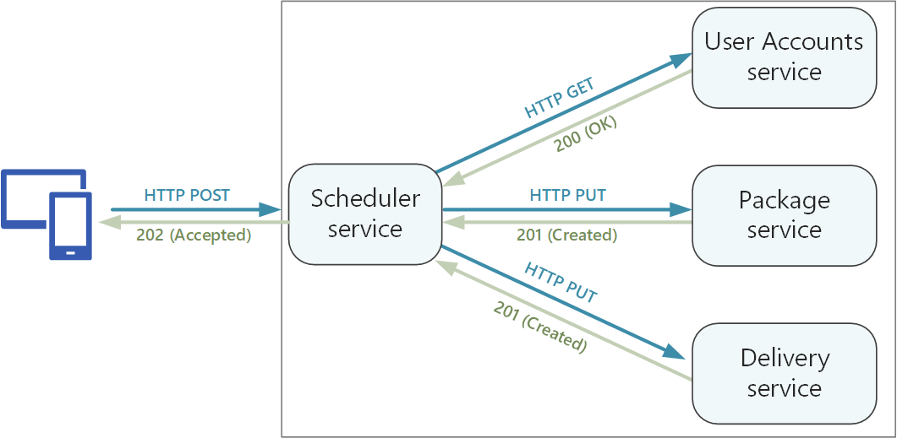
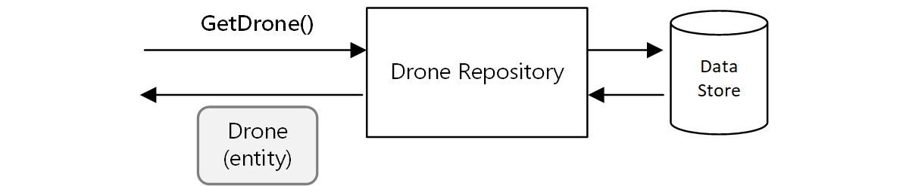
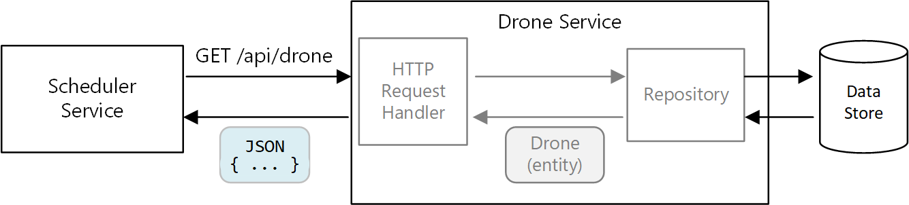
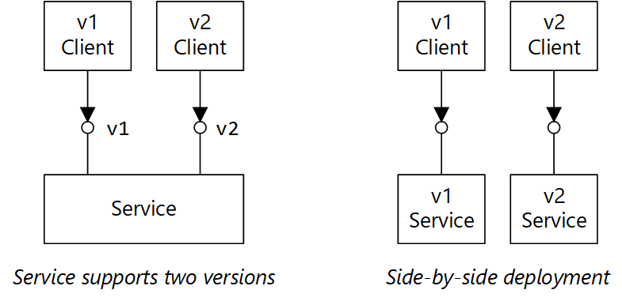

在微服务体系结构中，合理的 API 设计非常重要，因为服务之间的所有数据交换都是通过消息或 API 调用发生的。 API 必须有效，以避免出现[琐碎 I/O](https://docs.microsoft.com/zh-cn/azure/architecture/antipatterns/chatty-io/)。 由于服务是由独立工作的团队设计的，API 必须具有完善定义的语义和版本控制方案，使得更新不会中断其他服务。



必须区分两种类型的 API：

* 客户端应用程序调用的公共 API。
* 用于服务间通信的后端 API。

这两种用例在某种程度上有不同的要求。 公共 API 必须与客户端应用程序（通常是浏览器应用程序或本机移动应用程序）兼容。 在大多数情况下，这意味着公共 API 将使用基于 HTTP 的 REST。 但是，对于后端 API，需要考虑网络性能。 根据服务的粒度，服务间通信可能会导致大量的网络流量。 服务可能很快就会受到 I/O 的约束。 出于此原因，在序列化速度和有效负载大小等方面的考虑越发重要。 基于 HTTP 的 REST 的一些常见替代方案包括 gRPC、Apache Avro 和 Apache Thrift。 这些协议支持二进制序列化，并且通常比 HTTP 更加高效。

## 注意事项

下面是在选择如何实现 API 时要考虑的事项。

**REST** 与 **RPC。** 考虑 REST 样式接口与 RPC 样式接口各有哪些利弊。

* REST 对资源进行建模，这是表达域模型的自然方式。 REST 基于 HTTP 谓词定义统一接口，从而有利于可演化性。 它在幂等性、负面影响和响应代码方面具有完善定义的语义。 此外，它实施无状态通信，从而提高了可伸缩性。

* 相比之下，RPC 主要面向操作或命令。 由于 RPC 接口看上去与本地方法调用类似，因此可能导致设计出过于琐碎的 API。 但是，这并不意味着 RPC 一定是琐碎的， 只是在设计接口时需要慎重。

对于 RESTful 接口，最常见的选择是使用 JSON 的基于 HTTP 的 REST。 RPC 样式接口有多种常用框架，包括 gRPC、Apache Avro 和 Apache Thrift。

**效率**。 考虑速度、内存和有效负载大小方面的效率。 通常，基于 gRPC 的接口比基于 HTTP 的 REST 更快。

**接口定义语言 (IDL)**。 IDL 用于定义 API 的方法、参数和返回值。 IDL 可用于生成客户端代码、序列化代码和 API 文档。 IDL 还可以由 Postman 等 API 测试工具使用。 gRPC、Avro 和 Thrift 等框架定义自身的 IDL 规范。 基于 HTTP 的 REST 没有标准的 IDL 格式，常见的选择是 OpenAPI（前称为 Swagger）。 也可以不使用正式的定义语言来创建 HTTP REST API，但这样会失去代码生成和测试的优点。

**序列化。** 如何在线序列化对象？ 选项包括基于文本的格式（主要是 JSON）和二进制格式（例如协议缓冲区）。 二进制格式通常比基于文本的格式更快。 但是，JSON 在互操作性方面具有优势，因为大多数语言和框架都支持 JSON 序列化。 有些序列化格式需要固定的架构，但有些需要编译架构定义文件。 在这种情况下，需要将此步骤整合到生成过程。

**框架和语言支持。** 几乎每种框架和语言都支持 HTTP。 gRPC、Avro 和 Thrift 都有适用于 C++、C#、Java 和 Python 的库。 Thrift 和 gRPC 还支持 Go。

**兼容性和互操作性。** 如果选择 gRPC 等协议，则可能需要在公共 API 与后端之间创建协议转换层。 网关可以执行此功能。 如果使用服务网格，请考虑哪些协议与服务网格兼容。 例如，linkerd 为 HTTP、Thrift 和 gRPC 提供内置支持。

我们的基准建议是，除非需要二进制协议的性能优势，否则请选择基于 HTTP 的 REST。 基于 HTTP 的 REST 不需要特殊的库。 它只会产生极少程度的耦合，因为调用方不需要客户端存根即可与服务通信。 有丰富的工具生态系统，可支持 RESTful HTTP 终结点的架构定义、测试和监视。 最后，HTTP 与浏览器客户端兼容，因此，我们不需要在客户端与后端之间创建协议转换层。

但是，如果选择基于 HTTP 的 REST，则应提前在开发过程中执行性能和负载测试，以验证它的表现是否足以满足方案的需要。

## RESTful API 设计

可以参考许多的资源来设计 RESTful API。 下面是一些有用的资源：

* [API 设计](https://docs.microsoft.com/zh-cn/azure/architecture/best-practices/api-design)

* [API 实现](https://docs.microsoft.com/zh-cn/azure/architecture/best-practices/api-implementation)

* [Microsoft REST API 准则](https://github.com/Microsoft/api-guidelines)

下面是要注意的一些具体事项。

* 留意会暴露内部实现细节或直接映射内部数据库架构的 API。 API 应该为领域建模。 它是服务之间的协定，在理想情况下，应该只是在添加了新功能的情况下才对它进行更改，而不能仅仅因为重构了某些代码或规范化了数据库表，就对它进行更改。

* 不同类型的客户端（例如移动应用程序和桌面 Web 浏览器）可能需要不同的有效负载大小或交互模式。 请考虑使用用于[前端的后端模式](https://docs.microsoft.com/zh-cn/azure/architecture/patterns/backends-for-frontends)为每个客户端创建独立的后端，这些后端可公开该客户端的最佳接口。

* 对于产生副作用的操作，请考虑使其成为幂等操作，并将其实现为 PUT 方法。 这样，便可以安全重试并提高复原能力。 [服务间通信]()一文更详细地讨论了此问题。

* HTTP 方法可能采用异步语义，此时，方法将立即返回响应，但服务将以异步方式执行操作。 在这种情况下，方法应返回 [HTTP 202](https://www.w3.org/Protocols/rfc2616/rfc2616-sec10.html) 响应代码，指示请求已被接受进行处理，但处理尚未完成。 有关详细信息，请参阅[异步Request-Reply 模式](https://docs.microsoft.com/zh-cn/azure/architecture/patterns/async-request-reply)。

## 将 REST 映射到 DDD 模式

实体、聚合和值对象等模式旨在对领域模型中的对象施加特定的约束。 在 DDD 的许多介绍文章中，模式是使用构造函数或属性 getter 和 setter 等面向对象的 (OO) 语言概念建模的。 例如，值对象被认为是不可变的。 在 OO 编程语言中，需要通过在构造函数中分配值并将属性设为只读，来实施此模式：

```ts
export class Location {
    readonly latitude: number;
    readonly longitude: number;

    constructor(latitude: number, longitude: number) {
        if (latitude < -90 || latitude > 90) {
            throw new RangeError('latitude must be between -90 and 90');
        }
        if (longitude < -180 || longitude > 180) {
            throw new RangeError('longitude must be between -180 and 180');
        }
        this.latitude = latitude;
        this.longitude = longitude;
    }
}
```

构建传统的整体应用程序时，此类编程做法特别重要。 借助大型代码库，许多子系统可以使用 `Location` 对象，因此，对象必须实施正确的行为。

另一个示例是一个存储库模式，它可以确保应用程序的其他部分不会直接在数据存储中执行读取或写入：



但是，在微服务体系结构中，服务不共享同一个代码库，也不共享数据存储。 它们通过 API 进行通信。 假设计划程序服务需要从无人机服务请求有关无人机的信息。 无人机服务有自身的内部无人机模型（通过代码表示）。 但是，计划程序看不到该模型。 相反，它会返回 无人机实体 的表示形式， 可能是 HTTP 响应中的 JSON 对象。



计划程序服务无法修改无人机服务的内部模型，或写入无人机服务的数据存储。 这意味着，与传统整体应用程序中的代码相比，实现无人机服务的代码的公开外围应用更小。 如果无人机服务定义 Location 类，则该类的作用域将受到限制，任何其他服务将直接使用该类。

出于这些原因，本指南并未重点介绍编程做法，因为这些做法与战术 DDD 模式相关。 但事实证明，我们也可以通过 REST API 为许多 DDD 模式建模。

例如：

* 聚合自然映射到 REST 中的资源。 例如，交付 API 将交付聚合公开为资源。

* 聚合是一致性边界。 对聚合执行的操作永远不可以将某个聚合保持不一致状态。 因此，应避免创建允许客户端操纵聚合内部状态的 API。 应该优先使用可将聚合公开为资源的粗粒度 API。

* 实体具有唯一标识。 在 REST 中，资源具有 URL 格式的唯一标识符。 创建对应于实体领域标识的资源 URL。 从 URL 到领域标识的映射对于客户端可能是不透明的。

* 可以通过从根实体导航来访问聚合的子实体。 如果遵循了 [HATEOAS](https://en.wikipedia.org/wiki/HATEOAS) 原则的话，则可以通过父实体表示形式中的链接来访问子实体。

* 由于值对象是不可变的，可以通过替换整个值对象来执行更新。 在 REST 中，可通过 PUT 或 PATCH 请求来实现更新。

* 存储库可让客户端在集合中查询、添加或删除对象，以及提取基础数据存储的详细信息。 在 REST 中，集合可以是不同的资源，其中包含用于查询集合或将新实体添加到集合的方法。

设计 API 时，请考虑这些 API 如何表达领域模型。不仅要考虑到模型中的数据，而且还要考虑业务运营以及对数据的约束。

| DDD 概念   | REST 等效项  | 示例                                               |
| ---------- | ------------ | -------------------------------------------------- |
| 聚合       | 资源         | { "1":1234, "status":"pending"... }                |
| 标识       | URL          | https://delivery-service/deliveries/1              |
| 子实体     | 链接         | { "href": "/deliveries/1/confirmation" }           |
| 更新值对象 | PUT 或 PATCH | PUT https://delivery-service/deliveries/1/dropoff  |
| 存储库     | 集合         | https://delivery-service/deliveries?status=pending |

## API 版本控制

API 是服务与客户端之间的协定，或该服务的使用者。 如果某个 API 发生更改，依赖于该 API 的客户端存在中断的风险，不管是外部客户端还是其他微服务。 因此，最好是尽量减少对 API 的更改次数。 通常，基础实现中发生更改并不需要对 API 进行任何更改。 但实际上，在某个时候，我们需要添加新功能，这就需要更改现有的 API。

请尽量使 API 更改可向后兼容。 例如，避免从模型中删除字段，因为这可能会中断预期需要该字段的客户端。 添加字段不会破坏兼容性，因为客户端应该忽略响应中它们无法识别的任何字段。 但是，服务必须应对旧式客户端在请求中省略新字段的情况。

支持 API 协定中的版本控制。 如果做了重大的 API 更改，请推出新的 API 版本。 继续支持以前的版本，并让客户端选择要调用哪个版本。 可通过多种方法实现此目的。 一种简单的方法是在同一个服务中公开两个版本。 另一种方法是同时运行服务的两个版本，并根据 HTTP 路由规则，将请求路由到其中一个版本。



该关系图包含两个部分。 "服务支持两个版本" 显示 v1 客户端和 v2 客户端均指向一个服务。 "并行部署" 显示指向 v1 服务的 v1 客户端，以及指向 v2 服务的 v2 客户端。

支持多个版本会在开发人员时间、测试和运营开销方面产生成本。 因此，最好尽快淘汰旧版本。 对于内部 API，拥有该 API 的团队可与其他团队协作，帮助他们迁移到新版本。 此时，跨团队调控过程非常有用。 对于外部（公共）API，可能很难淘汰 API 版本，当 API 由第三方或本机客户端应用程序使用时尤其如此。

当服务实施更改时，使用版本来标记更改会很有用。 排查错误时，版本可提供重要信息。 执行根本原因分析时，版本可能十分有帮助，因为可以确切地知道调用了哪个服务版本。 考虑对服务版本使用[语义版本控制](https://semver.org/)。 语义版本控制使用 MAJOR.MINOR.PATCH 格式。 但是，客户端仅应根据主要版本号选择 API；如果次要版本之间发生重要（但非重大）的更改，则可以根据次要版本选择 API。 换而言之，客户端在 API 版本 1 与版本 2 之间做出选择是合理的做法，但不能选择版本 2.1.3。 如果允许这种粒度级，则可能存在必须为大量增生版本提供支持的风险。

有关 API 版本控制的其他介绍，请参阅对 [RESTful Web API 进行版本控制](https://docs.microsoft.com/zh-cn/azure/architecture/best-practices/api-design#versioning-a-restful-web-api)。

## 幂等操作

如果可以多次调用操作而不在第一次调用之后产生额外的副作用，则该操作是 幂等 的。 幂等性可能是一个有用的复原策略，因为它允许上游服务安全地多次调用操作。 有关这一点的讨论，请参阅 [分布式事务]()。

HTTP 规范中规定，GET、PUT 和 DELETE 方法必须是幂等的。 无法保证 POST 方法是幂等的。 如果 POST 方法创建新资源，则通常无法保证此操作是幂等的。 该规范对幂等的定义如下：

> 如果使用某个请求方法的多个相同请求对服务器造成的预期影响与单个此类请求所造成的影响相同，则认为该方法是“幂等的”。 ([RFC 7231](https://tools.ietf.org/html/rfc7231#section-4))

创建新实体时，必须了解 PUT 与 POST 语义之间的区别。 在这两种情况下，客户端都会在请求正文中发送实体的表示形式。 但 URI 的含义有所不同。

* 对于 POST 方法，URI 表示新实体的父资源，例如集合。 例如，若要创建新的交付项，URI 可能是 `/api/deliveries`。 服务器将创建实体并为其分配新 URI，例如 `/api/deliveries/39660`。 此 URI 将在响应的 Location 标头中返回。 每当客户端发送请求时，服务器都会创建一个具有新 URI 的新实体。

* 对于 PUT 方法，URI 标识实体。 如果已存在具有该 URI 的实体，则服务器会将现有实体替换为请求中的版本。 如果不存在具有该 URI 的实体，则服务器会创建一个实体。 例如，假设客户端向 `api/deliveries/39660` 发送了 PUT 请求。 此外，假设不存在具有该 URI 的交付项，则服务器会创建一个新的交付项。 现在，如果客户端再次发送相同的请求，则服务器会替换现有实体。

下面交付服务的 PUT 方法实现。

```C#
[HttpPut("{id}")]
[ProducesResponseType(typeof(Delivery), 201)]
[ProducesResponseType(typeof(void), 204)]
public async Task<IActionResult> Put([FromBody]Delivery delivery, string id)
{
    logger.LogInformation("In Put action with delivery {Id}: {@DeliveryInfo}", id, delivery.ToLogInfo());
    try
    {
        var internalDelivery = delivery.ToInternal();

        // Create the new delivery entity.
        await deliveryRepository.CreateAsync(internalDelivery);

        // Create a delivery status event.
        var deliveryStatusEvent = new DeliveryStatusEvent { DeliveryId = delivery.Id, Stage = DeliveryEventType.Created };
        await deliveryStatusEventRepository.AddAsync(deliveryStatusEvent);

        // Return HTTP 201 (Created)
        return CreatedAtRoute("GetDelivery", new { id= delivery.Id }, delivery);
    }
    catch (DuplicateResourceException)
    {
        // This method is mainly used to create deliveries. If the delivery already exists then update it.
        logger.LogInformation("Updating resource with delivery id: {DeliveryId}", id);

        var internalDelivery = delivery.ToInternal();
        await deliveryRepository.UpdateAsync(id, internalDelivery);

        // Return HTTP 204 (No Content)
        return NoContent();
    }
}
```

大多数请求预期会创建新实体，因此，该方法将对存储库对象乐观调用 `CreateAsync`，然后通过更新资源来处理任何重复资源异常。
