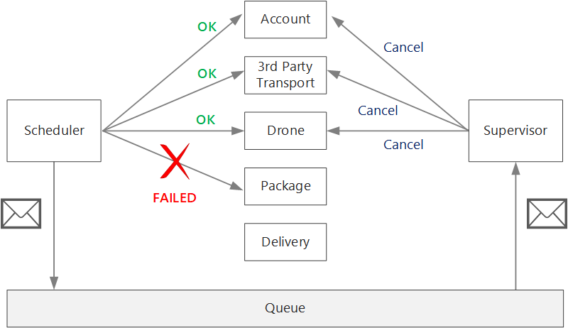

微服务之间的通信必须高效可靠。 随着许多小型服务交互以完成单个业务活动，这可能是一项挑战。 本文介绍异步消息传递与同步 API 之间的权衡。 然后，我们将了解设计弹性服务间通信时面临的一些难题。

## 挑战

下面是服务间通信存在的主要难题。 本文稍后介绍的服务网格旨在应对其中许多挑战。

**复原能力**。 任意给定的微服务可能有数十甚至数百个实例。 某个实例可能出于若干原因而发生故障。 可能出现节点级的故障，例如硬件故障或 VM 重新启动。 实例可能崩溃或收到不堪重负的请求，因此无法处理任何新请求。 其中的任何事件都可能导致网络调用失败。 可以借助两种设计模式，以更具弹性的方式发出服务间的网络调用：

**[重试](https://docs.microsoft.com/zh-cn/azure/architecture/patterns/retry)**。 网络调用可能由于暂时性故障（可自行消失）而失败。 调用方不会彻底失败，而通常会重试特定次数的操作，或者重试到配置的超时期限结束为止。 但是，如果操作不是幂等的，则重试可能导致意外的副作用。 原始调用可能成功，但调用方永远不会获得响应。 如果调用方重试，则可以调用操作两次。 一般而言，重试 POST 或 PATCH 方法并不安全，因为不保证这些方法是幂等的。

**[断路器](https://docs.microsoft.com/zh-cn/azure/architecture/patterns/circuit-breaker)**。 如果失败的请求过多，可能会导致出现瓶颈，因为挂起的请求会在队列中累积。 这些被阻止的请求可能占用关键的系统资源，例如内存、线程、数据库连接等，从而导致连发故障。 断路器模式可以防止服务重复尝试执行很可能失败的操作。

**负载均衡**。 当服务“A”调用服务“B”时，请求必须访问服务“B”的运行中实例。 在 Kubernetes 中，Service 资源类型为一组 pod 提供稳定的 IP 地址。 发往服务 IP 地址的网络流量将通过 iptable 规则转发到 pod。 默认情况下，会选择随机 pod。 服务网格（请参阅下文）可以根据观测到的延迟或其他指标提供更智能化的负载均衡算法。

**分布式跟踪**。 单个事务可能跨越多个服务。 因此，可能很难监视系统的整体性能和运行状况。 即使每个服务都生成日志和指标，但如果不通过某种方法将这些信息关联在一起，则它们的作用有限。 日志记录 和监视一 文对分布式跟踪进行了更多介绍，但我们在此处提到这一点是一项挑战。

**服务版本控制**。 当团队部署某个服务的新版本时，必须避免中断其他任何服务或依赖于该服务的外部客户端。 此外，我们可能需要同时运行某个服务的多个版本，并将请求路由到特定的版本。 有关此问题的详细讨论，请参阅 [API 版本控制](https://docs.microsoft.com/zh-cn/azure/architecture/microservices/design/api-design#api-versioning)。

**TLS 加密和相互 TLS 身份验证**。 出于安全原因，我们可能需要使用 TLS 加密服务之间的流量，并使用相互 TLS 身份验证对调用方进行身份验证。

## 同步与异步消息传递

微服务可以使用两种基本消息传递模式来与其他微服务通信。

1. 同步通信。 在此模式下，一个服务使用 HTTP 或 gRPC 等协议调用另一个服务公开的 API。 此选项之所以称作同步消息传递模式，是因为调用方需要等待接收方返回的响应。

2. 异步消息传递。 在此模式下，服务可以在不等待回应的情况下发送消息，然后一个或多个服务以异步方式处理该消息。

必须区分异步 I/O 和异步协议。 异步 I/O 表示在完成 I/O 时，调用线程不会阻塞。 这对于性能很重要，但在体系结构方面需要规划实施细节。 异步协议表示发送方无需等待响应。 HTTP 是同步协议，不过，HTTP 客户端在发送请求时可以使用异步 I/O。

每种模式各有利弊。 请求/响应是易于理解的范例，因此，设计 API 在感觉上可能比设计消息传递系统更单纯。 但是，异步消息传送具有一些优点，在微服务体系结构中非常有用：

* **减少耦合**。 消息发送方不需要了解使用者。

* **多个订阅方**。 使用发布/订阅模型，多个使用者可以订阅事件接收。 请参阅[事件驱动的体系结构样式](https://docs.microsoft.com/zh-cn/azure/architecture/guide/architecture-styles/event-driven)。

* **故障隔离**。 如果使用者发生故障，发送方仍可发送消息。 当使用者恢复时，将拾取消息。 此功能在微服务体系结构中尤其有用，因为每个服务具有自身的生命周期。 在任意给定时间，服务可能不可用，或者被新版本取代。 异步消息传递可以处理间歇性的停机。 另一方面，同步 API 需要下游服务保持可用，否则操作将会失败。

* **响应能力**。 上游服务如果不需要等待下游服务完成处理，则可以更快地做出回复。 这一点在微服务体系结构中尤其有用。 如果存在服务依赖关系链（服务 A 调用 B，后者调用 C，依此类推），则等待同步调用可能会增大不可接受的延迟时间。

* **负载均衡**。 队列可以充当缓冲区来调节工作负荷，使接收方可以根据自身的速率处理消息。

* **工作流**。 完成工作流中的每个步骤后，可以通过在消息中设置检查点，使用队列管理该工作流。

但是，有效使用异步消息传递也存在一些难题。

* **与消息传递基础结构耦合**。 使用特定的消息传递基础结构可能导致与该基础结构紧密耦合。 以后很难切换到另一个消息传递基础结构。

* **滞后时间。** 如果消息队列已填满，则操作的端到端延迟可能变得很高。

* **成本**。 吞吐量较高时，消息传递基础结构的资金成本可能很大。

* **复杂性**。 处理异步消息传递并不是一个简单的任务。 例如，必须通过消除重复项或使操作成为幂等操作，来处理重复的消息。 此外，很难使用异步消息传递实现请求-响应语义。 若要发送响应，需要使用另一个队列，并通过某种方式来关联请求和响应消息。

* **吞吐量**。 如果消息需要队列语义，则队列可能成为系统中的瓶颈。 每条消息至少需要一个排队操作和一个取消排队操作。 此外，队列语义通常需要在消息传递基础结构中进行某种锁定。 如果队列是托管服务，可能会进一步造成延迟，因为队列在群集虚拟网络的外部。 可以通过批处理消息来缓解这些问题，但这会增加代码的复杂性。 如果消息不需要队列语义，也许可以事件流来取代队列。 有关详细信息，请参阅事件驱动的体系结构样式。

## 无人机交付：选择消息传递模式

考虑到上述因素，开发团队针对无人机交付应用程序做出了以下设计选择

* 引入服务公开一个公共 REST API，客户端应用程序使用该 API 来安排、更新或取消交付。

* 引入服务使用事件中心将异步消息发送到计划程序服务。 必须使用异步消息来实现引入操作所需的负载调节。

* 帐户、交付、包裹、无人机和第三方运输服务全部公开内部 REST API。 计划程序服务调用这些 API 来执行用户请求。 使用同步 API 的原因之一是计划程序需要从每个下游服务获取响应。 任何一个下游服务失败都意味着整个操作失败。 但是，一个潜在的问题是调用后端服务造成的延迟量。

* 如果任何下游服务发生非事务性故障，则整个事务应标记为失败。 为了处理这种情况，计划程序服务向监督程序发送异步消息，以便监督程序可以安排补偿事务。

* 交付服务公开一个公共 API，客户端可使用该 API 获取交付状态。 在 API 网关一文，我们讨论了 API 网关如何对客户端隐藏基础服务，因此客户端不需要知道哪些服务公开了哪些 API。

* 当某架无人机已起飞时，无人机服务会发送包含该无人机当前位置和状态的事件。 交付服务会侦听这些事件，以跟踪交付状态。

* 当交付状态发生更改时，交付服务会发送交付状态事件，例如 DeliveryCreated 或 DeliveryCompleted。 任何服务都可以订阅这些事件。 在当前设计中，传递历史记录服务是唯一的订阅者，但以后可能有其他订阅者。 例如，事件可能会进入实时分析服务。 此外，由于计划程序无需等待响应，添加更多的订阅方并不影响主要工作流路径。

.png)

请注意，交付状态事件派生自无人机位置事件。 例如，当无人机抵达交货地点并投递了包裹时，交付服务会将此状态转换为 DeliveryCompleted 事件。 这是在域模型方面可以考虑的一个示例。 如前所述，无人机管理属于独立的边界上下文。 无人机事件传达无人机的物理位置。 另一方面，交付事件表示交付状态的更改，属于不同的业务实体。

## 使用服务网格

服务网格是处理服务间通信的软件层。 服务网格旨在解决上一部分中列出的许多问题，并将这些问题的责任从微服务本身转移到共享层。 服务网格充当代理，可截获群集中微服务之间的网络通信。 目前，服务网格概念主要适用于容器业务流程协调程序，而不是无服务器体系结构。

> 备注
>
> 服务网格是代表模式的 一 个示例 - 代表应用程序发送网络请求的帮助程序服务。

目前，Kubernetes 中服务网格的主要选项包括 [linkerd](https://linkerd.io/) 和 [Istio](https://istio.io/)。 这两种技术正在快速演进。 但是，linkerd 和 Istio 具有一些共同的功能，包括：

* 根据观测到的延迟或未完成的请求数，在会话级别进行负载均衡。 这样，便可以基于 Kubernetes 提供的第 4 层负载均衡来提高性能。

* 基于 URL 路径、主机标头、API 版本或其他应用程序级规则进行第 7 层路由。

* 失败请求重试。 服务网格可识别 HTTP 错误代码，并可以自动重试失败的请求。 可以配置最大重试次数和超时期限，以限制最大延迟。

* 断路。 如果某个实例一直无法完成请求，则服务网格会暂时性地将它标记为不可用。 在回退期过后，服务将重试该实例。 可以根据多个条件（例如连续失败次数）来配置断路器。

* 服务网格会捕获有关服务间调用的指标，例如请求量、延迟、错误和成功率，以及响应大小。 此外，服务网格可以通过添加请求中每个跃点的关联信息，来启用分布式跟踪。

* 服务间调用的相互 TLS 身份验证。

是否需要服务网格？ 视情况而定。 如果没有服务网格，则需要考虑本文开头提到的每个挑战。 不使用服务网格也可以解决重试、断路器和分布式跟踪等方面的问题，但是，服务网格可将这些问题从单个服务转移到专用的层。 另一方面，服务网格会增加群集的设置和配置的复杂性。 另外，它可能造成性能影响，因为请求现在是通过服务网格代理路由的，并且附加的服务在群集中的每个节点上运行。 在生产环境中部署服务网格之前，应该执行全面的性能和负载测试。

## 分布式事务

微服务中的一个常见挑战是正确处理跨多个服务的事务。 通常在此方案中，事务的成功是全部或无 - 如果其中一个参与服务失败，则整个事务必须失败。

有两种要考虑的事例：

* 服务可能会遇到暂时性 故障 ，例如网络超时。 通常，只需通过重试调用即可解决这些错误。 如果操作在尝试一定次数后仍然失败，则被视为非传输失败。

* 非重要故障是不太可能自行消失的任何故障。 非传输故障包括正常的错误条件，例如无效输入。 此外，还包括应用程序代码中未经处理的异常或进程崩溃。 如果发生此类错误，必须将整个业务事务标记为故障。 可能需要撤消同一个事务中已成功完成的其他步骤。

发生非事务性故障后，当前事务可能进入部分失败状态，其中一个或多个步骤已成功完成。 例如，如果无人机服务已安排无人机，则必须取消该无人机。 在这种情况下，应用程序需要使用[补偿事务](https://docs.microsoft.com/zh-cn/azure/architecture/patterns/compensating-transaction)撤消已成功的步骤。 在某些情况下，必须通过外部系统甚至手动过程来执行此操作。

如果补偿事务的逻辑比较复杂，请考虑创建一个单独的服务来负责处理此过程。 在无人机交付应用程序中，计划程序服务会将失败的操作放入专用队列。 一个单独的微服务（称作“监督程序”）会从此队列读取数据，并针对需要补偿的服务调用取消 API。 这是[计划程序代理监督程序模式](https://docs.microsoft.com/zh-cn/azure/architecture/patterns/scheduler-agent-supervisor)的一个变体。 监督程序服务可能还会执行其他操作，例如，通过文本或电子邮件通知用户，或将警报发送到操作仪表板。

例如，计划程序服务本身 (失败，因为节点崩溃) 。 在这种情况下，新实例可以启动并接管。 但是，必须恢复已在处理的任何事务。

一种方法是在工作流中完成每个步骤后将检查点保存到持久存储。 如果计划程序服务的实例在事务中间崩溃，则新实例可以使用检查点恢复上一个实例的中断位置。 但是，编写检查点可能会产生性能开销。

另一种选择是，将所有操作都设计为幂等。 如果某个操作可以调用多次，且在首次调用后不会产生其他副作用，则该操作是幂等的。 实质上，下游服务应忽略重复调用，这意味着服务必须能够检测重复调用。 实现幂等方法并不总是简单明了。 有关详细信息，请参阅 [幂等操作](https://docs.microsoft.com/zh-cn/azure/architecture/microservices/design/api-design#idempotent-operations)。
