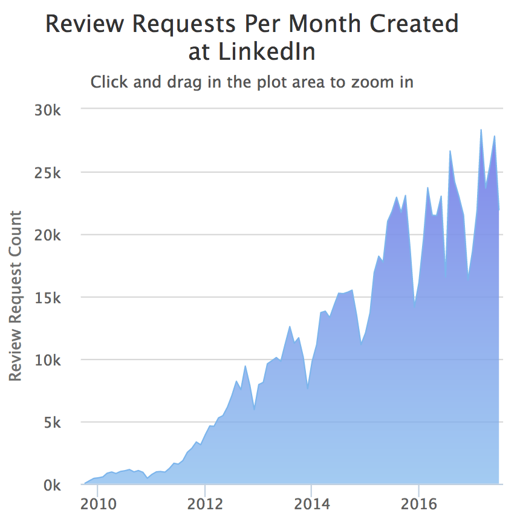

[原文](https://thenewstack.io/linkedin-code-review/)

*Linkedin最近完成了百万次代码审查的里程碑。社交网络服务工具的​​负责人在此分享了其中的一些经验教训。*

## 前言

阅读和审查代码是每个工程师每天都要做的事情。然而，正式的代码审查过程有些许差别，它要求代码在投入生产之前，要由团队其他成员对每次的代码变更都进行正式的审查。自2011年以来，在Linkedin代码审查已经是研发流程的重要组成部分。我们要求代码审核的目标是尽可能顺利地扩大我们快速发展的工程团队。使用有意义的有用注释进行良好的代码审查可以帮助提升整个工程组织的水平。在LinkedIn，这些审查已成为质量保证和知识共享的重要组成部分。拥抱代码审查已经在几个关键方面改变了我们的整个工程文化。

实施公司范围的代码审查的最大好处之一是我们的开发工作流程中的标准化程度提高了。LinkedIn的每个团队都使用相同的工具和流程进行代码审查，这意味着任何人都可以帮助审核或为其他团队的项目贡献代码。这消除了诸如“我可以修复代码中的错误，但我如何构建代码并提交修复程序？”之类的问题。反过来，这有助于增加工程组织中不同团队之间的协作。

通过使代码审查成为强制性流程，我们还帮助培养了公司健康的反馈文化：工程师愿意在所有工作领域提供和接收反馈，而不仅仅是编码，因为它已成为工作的常规组成部分。我们的工程师不会将代码审查视为对自己的批评或否定，而是将提供和接收代码审查作为自身专业成长的机会。事实上，高质量的代码审查是LinkedIn推广过程的重要组成部分，因为它们提供了工程技能的客观证据。

多年来，我们已经磨练了几个最佳实践和技巧，以便提供真正优秀的审查。以下是一些问题形式的指南，我们建议您帮助确保审核人员和被审核人员从代码审核中获得最大价值。

## 我理解“为什么”了么？

为了促进最佳审核并帮助您的团队扩展，每个代码更改提交都应包含一个设计概述，简要说明更改背后的动机。当需要从代码更改本身推断出基本原理时，很难提供高质量的代码审查。在提交代码审查之前，询问并期望提交者解释他们的动机是公平的。这也鼓励提交者在其提交信息中进行修改说明，从而提高代码文档的质量。

## 我给予了正面反馈了么？

在一个充满聪明人的组织中，干净的代码和整洁的测试覆盖率可以被视为理所当然。因此，代码审查反馈往往只关注代码中发现的问题和疑问。这是非常不幸的，因为大多数人需要积极的反馈才能感受到参与感和积极性 - 工程师也不例外。当审阅者在代码中看到好东西时，他们应该指出来并给出积极的反馈。这有助于提高团队动力，而且这种积极反馈往往具有传染性。与所有代码审查评论一样（下面有更多内容），任何积极的反馈都应该具体，解释为什么选中的代码写得很好。

## 我的代码评论评论解释清楚了么？

无论反馈是积极的还是消极的，任何代码审查评论都应该是不言自明的。对于收到解释不佳的代码审查意见的工程师来说，审阅者看起来显而易见的事情可能并不明确。如果有疑问，最好是额外说明，而不是提供简洁的反馈，从而产生更多的问题，并需要更多的来回沟通。解释可以简单到“减少重复”，“改善覆盖范围”或“使代码更容易测试”。除了使评论者的评论更加清晰之外，上面这些类型的解释还有助于强化团队渴望满足的设计原则。

## 我感谢提交者的努力了么？

无论结果如何，总是需要努力工作 - 这将培养强大，积极进取的团队。有些代码更改不是最高质量的，需要重新编写。在这些情况下，即使代码需要重新编写，仍然承认作者为更改付出的努力是很重要的。表达赞赏的最佳方式是努力进行代码审查，提供高质量的反馈和正确的解释，确认好的想法（每个代码提交中始终有好的东西！），并使用“谢谢“。

## 这些审查评论对我有用吗？

提出这个问题是验证代码审查评论是否必要的简单而有效的方法。在一天结束时，工程师应该将代码审查视为有用的开发工具，而不是不重要的繁忙工作的来源。如果您认为特定评论评论对您没有用，请将其删除。无用的代码审查注释的典型示例是与代码格式相关的注释。代码样式和格式应该由自动化工具验证，而不是工程师。

## “测试完成”部分是否足够彻底？

在LinkedIn，每个代码更改提交都有一个强制性的“测试完成”部分，需要填写。在开源世界中，使用GitHub作为示例，工程师可以在拉取请求描述中提交“测试完成”信息。“完成测试”应该取决于变化的严重程度和当前的测试覆盖水平。如果更改包含新的或更改的条件复杂性，那么期望它在单元测试中被涵盖是公平的。如果集成测试覆盖率不足，某些更改可能需要运行手动测试。在这些情况下，“测试完成”应包括有关测试场景和输出的信息。当更改改变程序的输出时，将新输出包含在“测试完成”部分中非常有用。

## 我的评论中是否太迂腐了？

一些代码评论有很多评论，重要的问题 - 真正需要修复的问题 - 在不太重要的建议中丢失。对特定团队的细节过于繁重的评论可能会减慢审核周期并导致审核人员和审核人员之间产生摩擦。明确的审核期望，示例评论以及积极，有吸引力的审核文化是避免冗长，耗费精力的审核周期的好方法。

## 总结

综上所述，拥有正式的代码审查流程有助于提高代码质量，团队学习和知识共享。

当团队中的每个工程师都意识到两件重要的事情时，工作质量会提高。

第一，别人会读我的代码，所以最好把代码写好点；

第二，我将不得不解决我收到的任何评论意见，因此我应该尝试在第一时间使我的代码变好，以便以后节省自己的努力。

当代码审查成为日常习惯时，团队会每天会给出和接收反馈。这是增长和改善的关键。

在LinkedIn，我们已经从过去的一次百万代码审查学到了很多东西，而且我们渴望从下一个百万学到更多。代码审查所付出的努力越多，团队在提供出色的代码审查方面就越好，签入的代码质量越高，构建的产品质量越高。高质量的代码审查具有传染性！