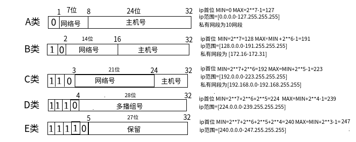
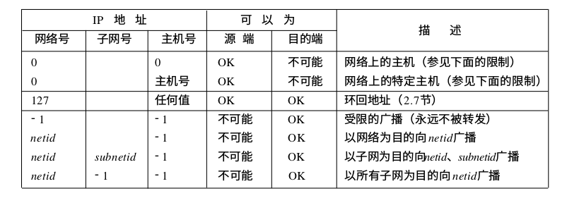
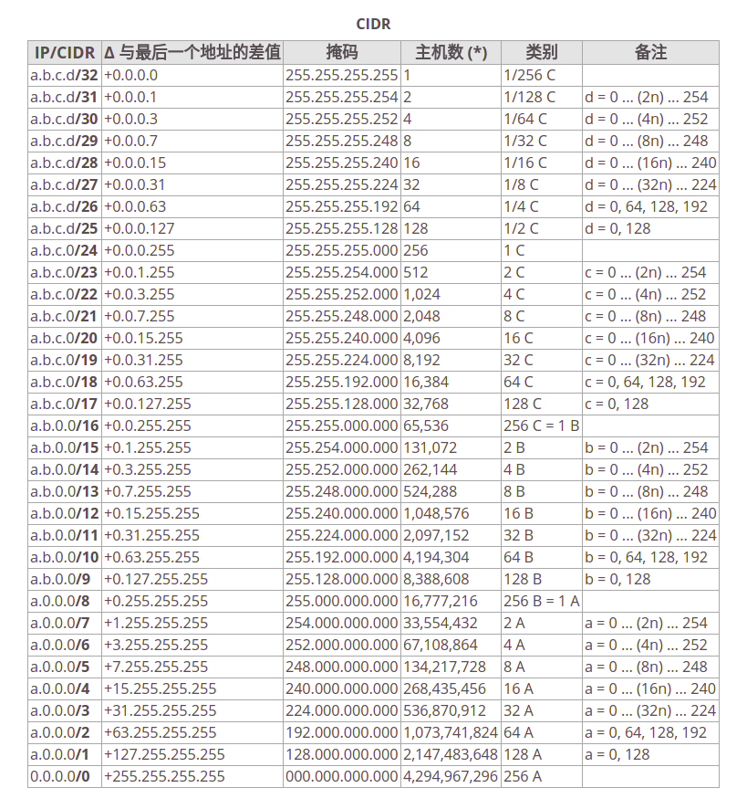

## ip分类和范围计算

IP地址由网络号和主机号组成。全0和全1的主机号无效。

从信息传播角度IP地址有三类：

* 单播地址（目的为单个主机）
* 广播地址（目的端为给定网络上的所有主机）
* 多播地址（目的端为同一组内的所有主机）

互联网IP划分：

## 子网寻址

IP地址除了网络号和主机号外，主机号可以再分为子网号和主机号，用来进行子网划分。

这样做的原因是因为 A类和B类地址为主机号分配了太多的空间,可分别容纳的主机数为224-2和216-2。事实上,在一个网络中人们并不安排这么多的主机。由于全0或全1的主机号都是无效的,因此我们把总数减去 2。子网划分缩减了路由表的规模。

## 子网掩码

主机需要知道有多少比特用于子网号及多少比特用于主机号。这是在引导过程中通过子网掩码来确定的。这个掩码是一个 32 bit的,其中值为 1的比特留给网络号和子网号,为 0的比特留给主机号。

给定IP地址和子网掩码以后,主机就可以确定 IP数据报的目的是:

* ( 1)本子网上的主机;
* (2)本网络中其他子网中的主机;
* ( 3)其他网络上的主机。

如果知道本机的IP地址,那么就知道它是否为 A类、B类或C类地址(从I P地址的高位可以得知),也就知道网络号和子网号之间的分界线。而根据子网掩码就可知道子网号与主机号之间的分界线。

## 特殊IP地址

经过子网划分的描述,现在介绍 7个特殊的 IP地址，如下图。 0表示所有的比特位全为 0;- 1表示所有的比特位全为 1;netid、subnetid和hostid分别表示不为全 0或全1的对应字段。子网号栏为空表示该地址没有进行子网划分。

## CIDR

无类别域间路由是基于可变长子网掩码（VLSM）来进行任意长度的前缀的分配的。在RFC 950（1985）中有关于可变长子网掩码的说明。CIDR包括：

* 指定任意长度的前缀的可变长子网掩码技术。遵从CIDR规则的地址有一个后缀说明前缀的位数，例如：192.168.0.0/16。这使得对日益缺乏的IPv4地址的使用更加有效。
* 将多个连续的前缀聚合成超网，以及，在互联网中，只要有可能，就显示为一个聚合的网络，因此在总体上可以减少路由表的表项数目。聚合使得互联网的路由表不用分为多级，并通过VLSM逆转“划分子网”的过程。
* 根据机构的实际需要和短期预期需要而不是分类网络中所限定的过大或过小的地址块来管理IP地址的分配的过程。

CIDR表如下图：

